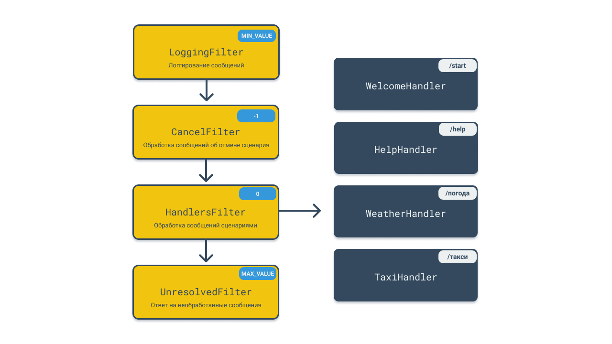

<!-- Описание -->

## Подключение

```
repositories {
    maven {
        url "https://dl.bintray.com/ruslanys/maven"
    }
}
```

Gradle: 

```
compile("me.ruslanys.telegraff:telegraff-starter:1.0.0-RC.25")
```

Maven:

```
<dependency>
    <groupId>me.ruslanys.telegraff</groupId>
    <artifactId>telegraff-starter</artifactId>
    <version>1.0.0-RC.25</version>
</dependency>
```

## Настройка

```
telegram.access-key=                  # api key
telegram.mode=                        # polling (default), webhook
telegram.webhook-base-url=            # required for webhook mode
telegram.webhook-endpoint-url=        # optional
```

## Использование

Положите файл с расширением `.kts` в папку c ресурсами `handlers`:
`resources/handlers/ExampleHandler.kts`.


```kotlin
enum class PaymentMethod {
    CARD, CASH
}

handler("/taxi", "такси") {
    step<String>("locationFrom") {
        question {
            MarkdownMessage("Откуда поедем?")
        }
    }

    step<String>("locationTo") {
        question {
            MarkdownMessage("Куда поедем?")
        }
    }

    step<PaymentMethod>("paymentMethod") {
        question {
            MarkdownMessage("Оплата картой или наличкой?", "Картой", "Наличкой")
        }

        validation {
            when (it.toLowerCase()) {
                "картой" -> PaymentMethod.CARD
                "наличкой" -> PaymentMethod.CASH
                else -> throw ValidationException("Пожалуйста, выбери один из вариантов")
            }
        }
    }

    process { state, answers ->
        val from = answers["locationFrom"] as String
        val to = answers["locationTo"] as String
        val paymentMethod = answers["paymentMethod"] as PaymentMethod

        // Business logic

        MarkdownMessage("Заказ принят. Поедем из $from в $to. Оплата $paymentMethod.")
    }
}
```

## Устройство


